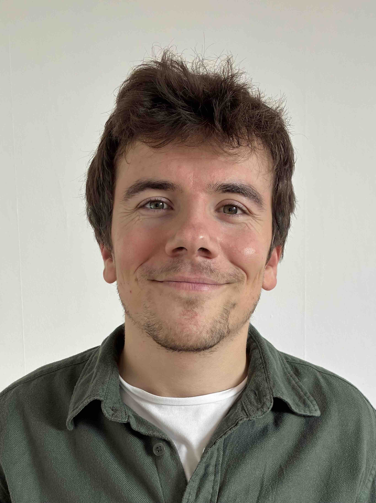
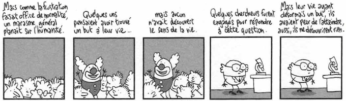

I am a Maître de conférences (~ associate professor) at [UVSQ](https://www.uvsq.fr), a constituent university of [Paris-Saclay](https://www.universite-paris-saclay.fr).

I teach at UVSQ [computer science department](https://www.sciences.uvsq.fr/departement-informatique).

My research unit is the [CRYPTO team](https://lmv.math.cnrs.fr/equipes/cryptologie/) of the [Laboratoire de Mathématiques de Versailles](https://lmv.math.cnrs.fr/) (LMV).

I work on **cryptography** (especially on analysis and design of symmetric primitives) and on **discrete mathematics** (in particular on Boolean functions).

Previously, I was:
- a postdoctoral researcher at [UCLouvain](https://www.uclouvain.be/) [Crypto Group](https://www-crypto.elen.ucl.ac.be/crypto/).
- a PhD student at [Inria](https://inria.fr) [COSMIQ team](https://www.rocq.inria.fr/secret/index-en.html).

> - **mail**: jules🎾baudrin@uvsq🎾fr
> - **office**: 306 A, Descartes building, third floor.
> - **address**: UVSQ, UFR des sciences,    45 av. des États Unis, 78000 Versailles, France.

